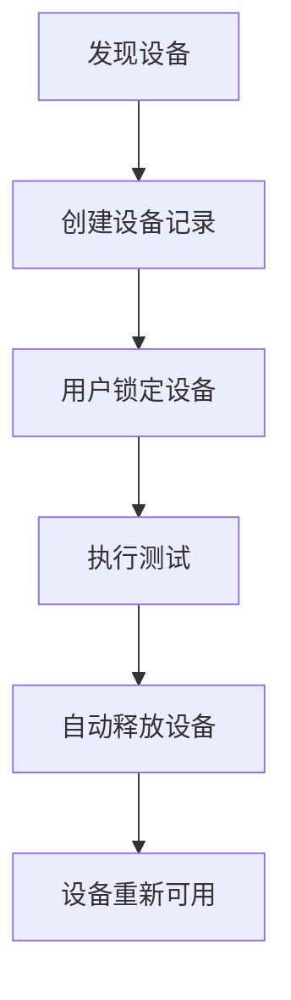
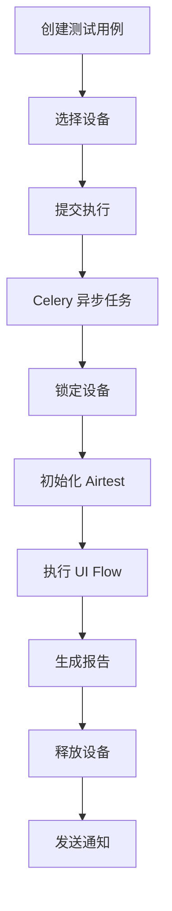

# APP 自动化测试集成说明

## ✅ 集成完成情况

**集成时间**: 2026-02-04  
**集成版本**: Phase 1 + Phase 2  
**集成状态**: 🟢 核心框架已完成，执行引擎开发中

---

## 📦 Phase 1：核心模块集成（已完成）

### 1. 数据模型 ✅

已创建 8 个核心数据模型：

| 模型 | 说明 | 数据表 |
|------|------|--------|
| `AppDevice` | Android 设备管理 | `app_devices` |
| `AppElement` | UI 元素管理 | `app_elements` |
| `AppComponent` | 基础组件定义 | `app_components` |
| `AppCustomComponent` | 自定义组件 | `app_custom_components` |
| `AppComponentPackage` | 组件包 | `app_component_packages` |
| `AppPackage` | 应用包名 | `app_packages` |
| `AppTestCase` | 测试用例 | `app_test_cases` |
| `AppTestExecution` | 执行记录 | `app_test_executions` |

**数据库迁移**: ✅ 已成功执行

### 2. 设备管理器 ✅

**文件**: `apps/app_automation/managers/device_manager.py`

**功能**:
- ✅ ADB 设备发现
- ✅ 连接/断开远程设备
- ✅ 获取设备详细信息（型号、Android 版本）
- ✅ 跨平台支持（Windows/Linux/macOS）

### 3. API 接口 ✅

**基础路径**: `/api/app-automation/`

**已实现的 ViewSet**:
- ✅ `AppDeviceViewSet` - 设备管理
- ✅ `AppElementViewSet` - 元素管理
- ✅ `AppComponentViewSet` - 组件管理
- ✅ `AppCustomComponentViewSet` - 自定义组件
- ✅ `AppComponentPackageViewSet` - 组件包
- ✅ `AppPackageViewSet` - 应用包名
- ✅ `AppTestCaseViewSet` - 测试用例
- ✅ `AppTestExecutionViewSet` - 执行记录

**特殊功能接口**:
- ✅ `GET /devices/discover/` - 发现 ADB 设备
- ✅ `POST /devices/{id}/lock/` - 锁定设备
- ✅ `POST /devices/{id}/unlock/` - 释放设备
- ✅ `POST /devices/connect/` - 连接远程设备
- ✅ `POST /test-cases/{id}/execute/` - 执行测试用例
- ✅ `POST /executions/{id}/stop/` - 停止执行

### 4. Django Admin ✅

**文件**: `apps/app_automation/admin.py`

所有模型已注册到 Admin 后台，支持在 `http://localhost:8000/admin/` 管理数据。

### 5. Celery 任务 ✅（占位符）

**文件**: `apps/app_automation/tasks.py`

**任务**:
- ✅ `execute_app_test_task` - 异步执行 APP 测试（占位符）
- ✅ `check_and_release_expired_devices` - 检查并释放过期设备

### 6. 路由配置 ✅

- ✅ `apps/app_automation/urls.py` - 应用路由
- ✅ `backend/urls.py` - 已添加主路由
- ✅ `backend/settings.py` - 已添加到 INSTALLED_APPS

---

## 📊 Phase 2：Dashboard 模块（已完成）

### Dashboard API ✅

**接口**: `GET /api/app-automation/dashboard/statistics/`

**返回数据**:
```json
{
  "success": true,
  "data": {
    "devices": {
      "total": 5,
      "online": 3,
      "locked": 1,
      "available": 4
    },
    "test_cases": {
      "total": 20
    },
    "executions": {
      "total": 100,
      "success": 85,
      "failed": 15,
      "pass_rate": 85.0
    },
    "recent_executions": [...]
  }
}
```

---

## 🔧 配置更新

### 1. Django Settings ✅

**文件**: `backend/settings.py`

```python
LOCAL_APPS = [
    # ... 现有应用 ...
    'apps.app_automation.apps.AppAutomationConfig',  # ✅ 新增
]
```

### 2. 主路由 ✅

**文件**: `backend/urls.py`

```python
urlpatterns = [
    # ... 现有路由 ...
    path('api/app-automation/', include('apps.app_automation.urls')),  # ✅ 新增
]
```

### 3. 依赖包 ✅

**文件**: `requirements.txt`

```python
# APP自动化测试依赖包
airtest>=1.3.0       # Android APP 自动化框架
pocoui>=1.0.88       # UI 控件识别（可选）
pytest-django>=4.5.0 # pytest Django 集成
loguru>=0.7.0        # 日志库
```

---

## 📂 目录结构

```
apps/app_automation/
├── __init__.py                  ✅ Django 应用入口
├── apps.py                      ✅ 应用配置
├── admin.py                     ✅ Admin 管理界面
├── models.py                    ✅ 数据模型（8个模型）
├── serializers.py               ✅ DRF 序列化器
├── views.py                     ✅ API 视图（9个ViewSet）
├── urls.py                      ✅ 路由配置
├── tasks.py                     ✅ Celery 任务（占位符）
├── constants.py                 ✅ 常量定义
├── README.md                    ✅ 模块说明文档
├── managers/                    ✅ 管理器
│   ├── __init__.py
│   └── device_manager.py        ✅ 设备管理器（完整功能）
├── runners/                     ⏳ 执行器（待开发）
│   └── __init__.py
├── executors/                   ⏳ 测试执行器（待开发）
│   └── __init__.py
├── utils/                       ⏳ 工具类（待开发）
│   └── __init__.py
└── migrations/                  ✅ 数据库迁移
    ├── __init__.py
    └── 0001_initial.py          ✅ 初始迁移文件
```

---

## 🎯 API 快速测试

### 1. 发现设备

```bash
curl http://localhost:8000/api/app-automation/devices/discover/
```

### 2. 获取 Dashboard 统计

```bash
curl http://localhost:8000/api/app-automation/dashboard/statistics/ \
  -H "Authorization: Bearer YOUR_ACCESS_TOKEN"
```

### 3. 查看 API 文档

访问: `http://localhost:8000/api/docs/`

在 Swagger UI 中搜索 "app-automation" 即可看到所有 APP 自动化相关的 API。

---

## 📝 后续开发计划

### 🔴 优先级 P0（必须完成）

#### 1. UiFlowRunner 完整实现（2-3 天）
**文件**: `apps/app_automation/runners/ui_flow_runner.py`

**需要迁移**:
- ✅ 从 `D:\smart_ai_test\backend\apps\ui_test\utils\ui_flow_runner.py` 迁移
- UI Flow 解析
- Airtest 动作执行
- 变量管理
- 元素解析
- 使用统计

#### 2. AirtestBase 基础类（1 天）
**文件**: `apps/app_automation/utils/airtest_base.py`

**需要迁移**:
- ✅ 从 `D:\smart_ai_test\backend\apps\ui_test\utils\airtest_base.py` 迁移
- 设备连接
- 截图管理
- 环境设置

#### 3. TestExecutor 完整实现（1-2 天）
**文件**: `apps/app_automation/executors/test_executor.py`

**需要迁移**:
- ✅ 从 `D:\smart_ai_test\backend\apps\ui_test\executors\test_executor.py` 迁移
- pytest 执行封装
- Allure 报告生成
- 进度追踪

#### 4. Celery 任务完整实现（1 天）
**文件**: `apps/app_automation/tasks.py`

**需要实现**:
- 完整的测试执行逻辑
- 设备锁定/释放
- 错误处理
- 结果统计

### 🟡 优先级 P1（重要）

#### 5. UI Flow 验证器（1 天）
**文件**: `apps/app_automation/utils/ui_flow_validator.py`

**需要迁移**:
- ✅ 从 `D:\smart_ai_test\backend\apps\ui_test\utils\ui_flow_validator.py` 迁移
- UI Flow Schema 验证
- 组件展开

#### 6. 图片元素上传（1 天）
**功能**:
- 图片文件上传接口
- 图片存储管理
- 缩略图生成

### 🟢 优先级 P2（可选）

#### 7. pytest 配置文件（0.5 天）
**文件**: `apps/app_automation/conftest.py`

#### 8. 测试套件支持（2-3 天）
**新模型**: `AppTestSuite`, `AppTestSuiteCase`

---

## 🚀 验证集成结果

### 1. 检查数据库表

```sql
SHOW TABLES LIKE 'app_%';
```

应该看到 8 个新表。

### 2. 检查 Django Admin

访问 `http://localhost:8000/admin/`，在左侧菜单应该看到 **"APP自动化测试"** 分类。

### 3. 检查 API 文档

访问 `http://localhost:8000/api/docs/`，搜索 "app"，应该看到所有 APP 自动化相关的 API 接口。

### 4. 测试设备发现 API

```bash
# 确保有 Android 设备连接或模拟器运行
curl http://localhost:8000/api/app-automation/devices/discover/
```

---

## 🔗 与现有模块的集成点

### 1. 用户系统 ✅
- 复用 `apps.users` 的用户模型
- 设备锁定关联用户
- 执行记录关联创建人

### 2. 通知系统 🔄（待集成）
- 复用 `apps.core.UnifiedNotificationConfig`
- 测试执行完成后发送通知

### 3. 报告系统 🔄（待集成）
- 复用 `apps.reports` 的报告生成
- Allure 报告集成

### 4. 项目管理 🔄（可选）
- 扩展 `apps.projects.Project` 支持 APP 测试项目

---

## 📋 环境准备

### 1. 安装 ADB

#### Windows
```bash
# 下载 Android SDK Platform Tools
# https://developer.android.com/studio/releases/platform-tools

# 配置环境变量
setx PATH "%PATH%;C:\path\to\platform-tools"
```

#### macOS
```bash
brew install android-platform-tools
```

#### Linux
```bash
sudo apt-get install android-tools-adb
```

### 2. 安装依赖

```bash
# 激活虚拟环境
E:\python_venv\testhub\Scripts\activate.bat  # Windows

# 安装新依赖
pip install airtest>=1.3.0
pip install pocoui>=1.0.88
pip install pytest-django>=4.5.0
pip install loguru>=0.7.0
```

### 3. 连接 Android 设备

```bash
# 连接 USB 设备（需开启 USB 调试）
adb devices

# 连接远程设备
adb connect 192.168.1.100:5555
```

---

## 🧪 测试示例

### 1. 创建设备

通过 API 或 Admin 后台创建设备记录，或使用自动发现功能。

### 2. 创建应用包名

```json
POST /api/app-automation/packages/
{
  "name": "淘宝",
  "package_name": "com.taobao.taobao"
}
```

### 3. 创建图片元素

```json
POST /api/app-automation/elements/
{
  "name": "登录按钮",
  "element_type": "image",
  "tags": ["登录", "首页"],
  "config": {
    "file_path": "common/login_button.png",
    "threshold": 0.7,
    "rgb": true
  }
}
```

### 4. 创建测试用例

```json
POST /api/app-automation/test-cases/
{
  "name": "淘宝登录测试",
  "description": "测试淘宝APP登录流程",
  "app_package": 1,
  "ui_flow": {
    "steps": [
      {
        "action": "touch",
        "selector_type": "image",
        "selector": "login_button.png"
      },
      {
        "action": "sleep",
        "duration": 2
      }
    ]
  },
  "variables": []
}
```

### 5. 执行测试用例

```json
POST /api/app-automation/test-cases/1/execute/
{
  "device_id": "emulator-5554"
}
```

---

## 🔄 待完成功能

### 短期（1-2 周）

#### 1. UiFlowRunner 完整实现 ⏳
**位置**: `apps/app_automation/runners/ui_flow_runner.py`

**需要迁移的文件**:
```
D:\smart_ai_test\backend\apps\ui_test\utils\ui_flow_runner.py
→ d:\testhub_platform\apps\app_automation\runners\ui_flow_runner.py
```

**核心功能**:
- UI Flow JSON 解析
- Airtest 动作执行（touch/swipe/wait/exists 等）
- 变量管理（global/local/outputs）
- 元素解析（图片/坐标/区域）
- 截图和日志记录
- Allure 报告集成

#### 2. AirtestBase 基础类 ⏳
**位置**: `apps/app_automation/utils/airtest_base.py`

**需要迁移的文件**:
```
D:\smart_ai_test\backend\apps\ui_test\utils\airtest_base.py
→ d:\testhub_platform\apps\app_automation\utils\airtest_base.py
```

**核心功能**:
- Airtest 环境初始化
- 设备连接（init_device）
- 模拟器自动启动
- 截图目录管理
- 重试机制

#### 3. UiTestExecutor 完整实现 ⏳
**位置**: `apps/app_automation/executors/test_executor.py`

**需要迁移的文件**:
```
D:\smart_ai_test\backend\apps\ui_test\executors\test_executor.py
→ d:\testhub_platform\apps\app_automation\executors\test_executor.py
```

**核心功能**:
- pytest 执行封装
- 环境变量管理（PYTHONPATH、DJANGO_SETTINGS_MODULE）
- Allure 结果解析
- Allure 报告生成
- 进度计算

#### 4. Celery 任务完整实现 ⏳
**位置**: `apps/app_automation/tasks.py`

**需要实现**:
```python
@shared_task
def execute_app_test_task(execution_id):
    # 1. 锁定设备
    # 2. 初始化 Airtest
    # 3. 执行 UI Flow
    # 4. 生成 Allure 报告
    # 5. 更新执行记录
    # 6. 释放设备
    # 7. 发送通知
```

### 中期（2-4 周）

#### 5. 前端页面开发 ⏳

**目录**: `frontend/src/views/app-automation/`

**需要开发的页面**:
- `DeviceList.vue` - 设备管理
- `ElementList.vue` - 元素管理
- `ComponentList.vue` - 组件管理
- `TestCaseEditor.vue` - 测试用例编辑器
- `ExecutionList.vue` - 执行记录
- `Dashboard.vue` - Dashboard 面板

#### 6. UI Flow 可视化编辑器 ⏳
- 拖拽式组件编排
- 元素选择器
- 变量编辑器
- 实时预览

### 长期（4-8 周）

#### 7. 测试套件支持 ⏳
- `AppTestSuite` 模型
- 批量执行
- 套件报告

#### 8. 定时任务支持 ⏳
- `AppScheduledTask` 模型
- Cron 表达式配置
- 定时执行

#### 9. WebSocket 实时推送 ⏳
- 执行进度实时更新
- 设备状态实时监控

---

## 🐛 已知限制

### 当前限制

1. **执行引擎未完成** ⚠️
   - `execute_app_test_task` 任务是占位符
   - 实际不会执行 Airtest 测试
   - 需要完成 UiFlowRunner 和 AirtestBase 的迁移

2. **图片元素上传未实现** ⚠️
   - 需要实现文件上传接口
   - 需要配置 MEDIA_ROOT 存储图片

3. **Allure 报告未集成** ⚠️
   - 报告生成逻辑未实现
   - 报告路径配置待完善

4. **前端页面未开发** ⚠️
   - 当前只有 API 接口
   - 需要开发 Vue 前端页面

### 依赖限制

1. **Airtest 需要安装**
   - 需运行 `pip install airtest`
   - 首次使用需要下载 Airtest 依赖

2. **ADB 需要配置**
   - 系统需要安装 Android SDK Platform Tools
   - 需要配置 ADB 环境变量

3. **Android 设备需要准备**
   - 本地模拟器（如雷电、夜神、Genymotion）
   - 或远程真机设备

---

## 🔍 验证清单

### 数据库验证 ✅

```bash
# 连接 MySQL
mysql -u root -p

# 查看表
USE testhub;
SHOW TABLES LIKE 'app_%';

# 应该看到 8 个表
# app_components
# app_custom_components
# app_component_packages
# app_devices
# app_elements
# app_packages
# app_test_cases
# app_test_executions
```

### Django Admin 验证 ✅

1. 访问 `http://localhost:8000/admin/`
2. 在左侧菜单找到 **"APP自动化测试"** 分类
3. 应该看到 8 个模型管理入口

### API 验证 ✅

1. 访问 `http://localhost:8000/api/docs/`
2. 搜索 "app-automation"
3. 应该看到所有 APP 自动化 API

---

## 📖 技术文档

### 设备管理流程



### 测试执行流程



---

## 🆘 常见问题

### Q1: 找不到 ADB 命令？
**A**: 请安装 Android SDK Platform Tools 并配置环境变量。

### Q2: 设备发现失败？
**A**: 检查 ADB 是否正常工作：`adb devices`

### Q3: 执行测试没有反应？
**A**: 当前执行引擎是占位符，需要完成 UiFlowRunner 的迁移。

### Q4: 如何连接远程设备？
**A**: 使用 `POST /api/app-automation/devices/connect/` 接口。

---

## 📞 技术支持

如有问题，请查阅：
1. 本模块 README: `apps/app_automation/README.md`
2. Airtest 官方文档: https://airtest.doc.io.netease.com/
3. 项目主 README: `README.md`

---

**集成人员**: TestHub Team  
**最后更新**: 2026-02-04  
**版本**: v1.0.0 - Phase 1 + Phase 2
